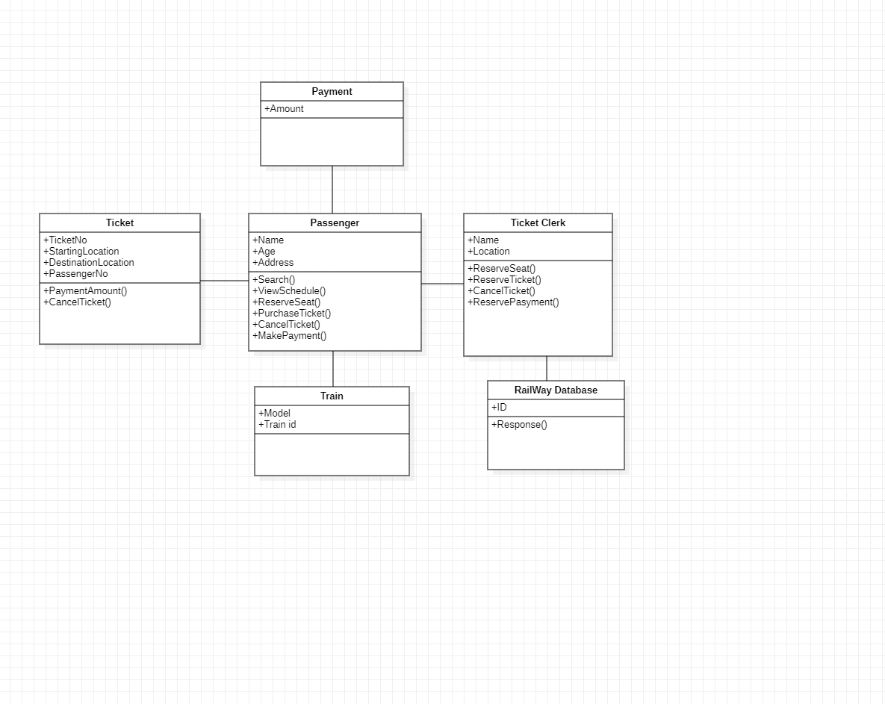

# Lab-3-Railway-Reservation

### AIM:
To develop the Railway Reservation System using Star UML tool.
### PROBLEM STATEMENT:
1. An E-Ticket (Electronic ticket) is a paperless electronic document used for ticketing
passengers, particularly in the commercial airline, railway industries.
2. An E-Ticket offers many advantages for both travelers and airline including security,
flexibility and cost convenience. At the same time, it also provides the standard assurance of
the traditional paper ticket, scaling choice, travel time options and other flexibilities.
3. Passengers typically print out copies of their E-Ticket including confirmation E-mail
and other document. All those documents can be replaced by pulling them out of the computer
again and only a person with proper identification can actually use an E-Ticket.
4. E-Ticket passengers can receive everything from gate assignments to cancellation or
delay through E-mail, text messages sent to their home or business computers or to their cell
phones.
5. Finally, using E-Ticket is a more environmental friendly approach. The main purpose
of the online bus ticket system is to provide another way for transnational customers to buy
their tickets.
### UML DIAGRAMS:

```
DEVELOPED BY : KULASEKARAPANDIAN K
REGISTER NO : 212222240052
```

#### CLASS DIAGRAM:

#### USECASE DIAGRAM:

#### PACKAGE DIAGRAM:

#### ACTIVITY DIAGRAM:

#### SEQENCE DIAGRAM:

#### COMMUNICATION DIAGRAM:


### RESULT:
Thus the project to develop e-ticketing system was developed using Star UML Software.
